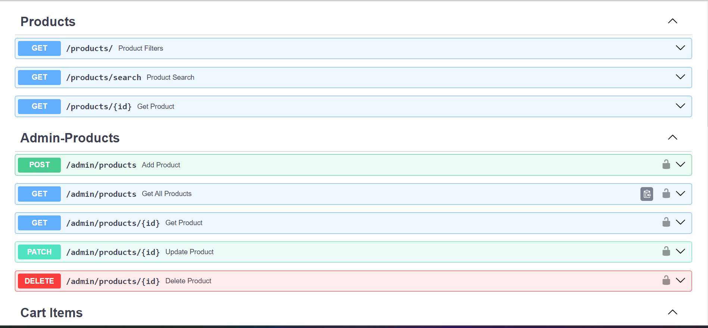

# 🛒 E-commerce Backend with FastAPI

This is a backend system for an e-commerce platform built using **FastAPI**. It provides RESTful APIs for user authentication, product browsing, cart management, and order tracking. The project focuses on clean architecture, secure authentication, and modular development.

---

## About the Project

The goal was to build a backend system that could support a basic e-commerce use case — including user registration, admin-managed products, shopping cart operations, and order placement.

Key highlights:
- JWT-based authentication with role-based access
- Admin can perform full CRUD on products
- Users can browse, filter, and search products
- Cart and dummy checkout functionality included
- Orders stored and viewable by users

Everything is tested via **Postman**, and the APIs are self-documented using **Swagger UI**.

---

## Tech Stack Used

- **FastAPI** – for building the API
- **PostgreSQL** – database
- **SQLAlchemy** – ORM for DB interaction
- **Pydantic** – for input validation
- **JWT (PyJWT)** – for authentication
- **Uvicorn** – ASGI server to run FastAPI app

---

## Project Structure (Simplified View)
app/
auth/ → Signup, Login, Reset Password
products/ → Admin product CRUD
cart/ → Add/remove/update cart items
orders/ → Dummy checkout & order history
core/ → DB setup, config, exception handling, dependencies
main.py → Entry point

---

## Authentication

- Users can sign up and log in
- JWT access and refresh tokens are returned
- Passwords are securely hashed
- Forgot/Reset password feature implemented via token
- Role-based access control (admin vs user)

---

## Product APIs

Admins can:
- Create new products
- Update/delete products
- View all products with pagination

Users can:
- Browse and search public product listings
- View product details

---

## Cart & Orders

Users can:
- Add or remove items in cart
- Update quantity
- Checkout (dummy) — order gets created and cart is cleared
- View past orders and order details

---

## Testing

All endpoints were manually tested using **Postman**.  
Sample tests include:
- Auth flow (signup, login, reset)
- Product creation/update
- Cart operations and checkout

---

## API Docs

Swagger docs available at:
http://localhost:8080/docs

## DATABASE SCHEMA AND E-R DIAGRAM

## Swagger UI Example

---

## Setup Instructions

1. **Clone the repo:**

git clone https://github.com/yourusername/ecommerce-backend.git
cd ecommerce-backend

2. **Create virtual environment:**

python -m venv venv
source venv/bin/activate

3. **Install Dependencies**

pip install -r requirements.txt

4. **Setup .env file (for DB, JWT, email)**

5. **Start the virtual environment.**

venv/Scripts/activate

6. **uvicorn app.main:app --reload**

## Security Measures

Passwords hashed using bcrypt

Input validated with Pydantic

JWT tokens with expiration

Role-based endpoint access

Secure password reset with token usage

